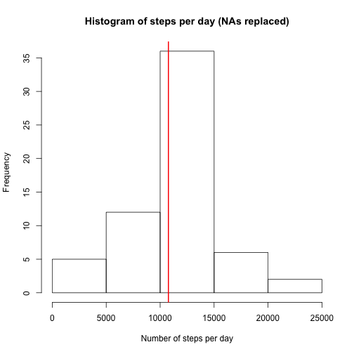

Peer Assessment Number 1
==========================

## Loading and preprocessing the data


```r
setwd("~/Desktop/Data Science/Data Science Coursera /RepResearch/RepData_PeerAssessment1")  
data <- read.csv("activity.csv")
```

Date column is converted to as.Date.


```r
data$date <- as.Date(data$date)
```

Interval column is converted to H:M format.


```r
#data$interval <- sprintf("%04d", data$interval)
#data$interval <- as.POSIXct(data$interval, format="%H%M")
#data$interval <- format(data$interval, format="%H:%M:%S")
```

## Question 1: What is mean total number of steps taken per day?

Total steps per unique date are calculated and shown on a histogram.


```r
dates <- unique(data$date)
StepsPerDay <- NULL

for (x in dates) {
        total <- sum(data$steps[which(data$date==x)], na.rm=TRUE)
        StepsPerDay <- append(StepsPerDay, total)
}

hist(StepsPerDay, xlab="Number of steps per day", main="Histogram of steps per day")
```

 

```r
mean_steps <- round(mean(StepsPerDay), digits=2)
median_steps <- median(StepsPerDay)
```

The mean total of steps per day was **9354.23**. The Median was **10395**.

## Question 2: What is the average daily activity pattern?

Mean steps per unique time interval are calculated and shown in a time series plot.


```r
intervals <- unique(data$interval)
StepsPerInt <- NULL

for (x in intervals) {
        avg <- mean(data$steps[which(data$interval==x)], na.rm=TRUE)
        StepsPerInt <- append(StepsPerInt, avg)
}

Q2_df <- data.frame(interval=intervals, mean_steps=StepsPerInt)

plot(Q2_df$interval, Q2_df$mean_steps, type="l", xlab="Time", ylab="Mean Steps", main="Daily Activity Pattern")
```

 

```r
int_max <- Q2_df[which(Q2_df$mean_steps==max(Q2_df$mean_steps)),1]
max_mean <- round(Q2_df[which(Q2_df$mean_steps==max(Q2_df$mean_steps)),2], digits=2)
```

The time interval with the maximum number of steps was **835** with a mean of **206.17** steps.

## Question 3: Imputing missing values

The number of missing rows are calculated below.


```r
comp <- complete.cases(data)
na_rows <- length(data$interval)-sum(comp)
```

The total number of rows with NAs is **2304**.

The following replaces NA values in the steps column with the mean of the corresponding interval. A histogram is created to show the number of steps taken per day, adjusting for NA values.


```r
complete_data <- data

for (i in seq_along(data$steps)) {
        int <- complete_data$interval[i]
        if (is.na(complete_data$steps[i])) {
                complete_data$steps[i] <- Q2_df[which(Q2_df$interval==int),2]
                }
        
}

StepsPerDay2 <- NULL

for (x in dates) {
        total <- sum(data$steps[which(data$date==x)], na.rm=TRUE)
        StepsPerDay2 <- append(StepsPerDay2, total)
}

hist(StepsPerDay2, xlab="Number of steps per day", main="Histogram of steps per day (NAs replaced")
```

 

```r
adj_mean <- round(mean(StepsPerDay2), digits=2)
adj_median <- median(StepsPerDay2)
```

The adjusted mean total of steps per day was **9354.23**. The Median was **`r`**.

## Question 4: Are there differences in activity patterns between weekdays and weekends?

First a new column which defines each entry as either "weekend" or "weekday" is created.


```r
complete_data$weekday <- NULL
for (x in seq_along(complete_data$date)) {
        day <- weekdays(complete_data$date[x])
        weekdays <- c("Monday", "Tuesday", "Wednesday", "Thursday", "Friday")
        if (day %in% weekdays) {
                complete_data$weekday[x] <- "weekday"
        }
        else {
                complete_data$weekday[x] <- "weekend"
        }
}
```

Then, the difference between weekend and weekday activity is shown on a panel plot:


```r
weekday_steps <- NULL
weekend_steps <- NULL

for (x in intervals) {
        avg_day <- mean(complete_data$steps[which(complete_data$interval==x
                                                  & complete_data$weekday=="weekday")])
        avg_end <- mean(complete_data$steps[which(complete_data$interval==x
                                                  & complete_data$weekday=="weekend")])
        weekday_steps <- append(weekday_steps, avg_day)
        weekend_steps <- append(weekend_steps, avg_end)
}

weekday_df <- data.frame(interval=intervals, mean_steps=weekday_steps, day="weekday")
weekend_df <- data.frame(interval=intervals, mean_steps=weekend_steps, day="weekend")
Q4_df <- rbind(weekday_df, weekend_df)

library(lattice)
xyplot(mean_steps ~ interval | day, data = Q4_df, layout = c(1,2), type="l", ylab="Mean Steps", xlab="Time")
```

 
