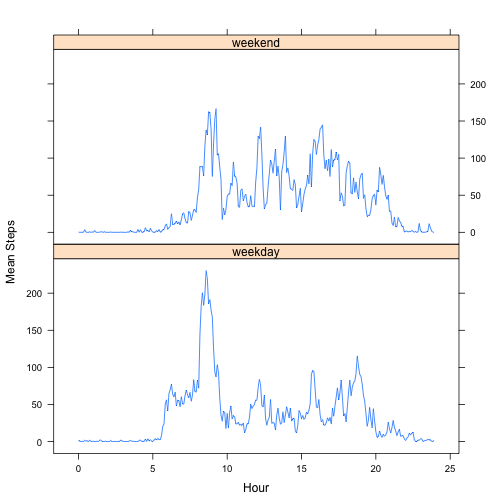

Peer Assessment Number 1
==========================

## Loading and preprocessing the data


```r
setwd("~/Desktop/Data Science/Data Science Coursera /RepResearch/RepData_PeerAssessment1")  
data <- read.csv("activity.csv")
```

Date column is converted to as.Date.


```r
data$date <- as.Date(data$date)
```

Interval column is converted to 24-hours.


```r
library(lubridate)
interval.lub <- sprintf("%04d", data$interval)
interval.lub <- as.POSIXct(interval.lub, format="%H%M")
interval.lub <- ymd_hms(interval.lub)
interval.lub <- hour(interval.lub) + minute(interval.lub)/60
data$interval <- interval.lub
```

## Question 1: What is mean total number of steps taken per day?

Total steps per unique date are calculated and shown on a histogram.


```r
dates <- unique(data$date)
StepsPerDay <- NULL

for (x in dates) {
        total <- sum(data$steps[which(data$date==x)], na.rm=TRUE)
        StepsPerDay <- append(StepsPerDay, total)
}

mean_steps <- round(mean(StepsPerDay), digits=2)
median_steps <- median(StepsPerDay)

hist(StepsPerDay, xlab="Number of steps per day", main="Histogram of steps per day")
abline(v=mean_steps, col="blue", lwd=2)
abline(v=median_steps, col="red", lwd=2)
```

 

The mean total of steps per day (blue) was **9354.23**. The Median (red) was **10395**.

## Question 2: What is the average daily activity pattern?

Mean steps per unique time interval are calculated and shown in a time series plot.


```r
intervals <- unique(data$interval)
StepsPerInt <- NULL

for (x in intervals) {
        avg <- mean(data$steps[which(data$interval==x)], na.rm=TRUE)
        StepsPerInt <- append(StepsPerInt, avg)
}

Q2_df <- data.frame(interval=intervals, mean_steps=StepsPerInt)

plot(Q2_df$interval, Q2_df$mean_steps, type="l", xlab="Hour", ylab="Mean Steps", main="Daily Activity Pattern")
```

 

```r
int_max <- round(Q2_df[which(Q2_df$mean_steps==max(Q2_df$mean_steps)),1], digits=2)
max_mean <- round(Q2_df[which(Q2_df$mean_steps==max(Q2_df$mean_steps)),2], digits=2)
```

The time interval with the maximum number of steps was **8.58** with a mean of **206.17** steps.

## Question 3: Imputing missing values

The number of missing rows are calculated below.


```r
comp <- complete.cases(data)
na_rows <- length(data$interval)-sum(comp)
```

The total number of rows with NAs is **2304**.

The following replaces NA values in the steps column with the mean of the corresponding interval. A histogram is created to show the number of steps taken per day, adjusting for NA values.


```r
complete_steps <- NULL

for (i in seq_along(data$steps)) {
        int <- complete_data$interval[i]
        stp <- complete_data$steps[i]
        avg <- Q2_df[which(Q2_df$interval==int),2]
        if (is.na(stp)) {
                complete_steps <- append(complete_steps,avg)
                }
        else {
                complete_steps <- append(complete_steps,stp)
        }
        
}
data$comp.steps <- complete_steps
```

```
## Error in `$<-.data.frame`(`*tmp*`, "comp.steps", value = c(1.71698113207547, : replacement has 15304 rows, data has 17568
```

```r
StepsPerDay2 <- NULL

for (x in dates) {
        total <- sum(data$comp.steps[which(data$date==x)], na.rm=TRUE)
        StepsPerDay2 <- append(StepsPerDay2, total)
}

adj_mean <- round(mean(StepsPerDay2), digits=2)
adj_median <- round(median(StepsPerDay2), digits=2)

hist(StepsPerDay2, xlab="Number of steps per day", main="Histogram of steps per day (NAs replaced)")

abline(v=adj_mean, lwd=2, col="red")
```

 

The adjusted mean total of steps per day (red) was **10766.19** and the median was also **10766.19**.

## Question 4: Are there differences in activity patterns between weekdays and weekends?

First a new column which defines each entry as either "weekend" or "weekday" is created.


```r
data$weekday <- NULL
for (x in seq_along(data$date)) {
        day <- weekdays(data$date[x])
        weekdays <- c("Monday", "Tuesday", "Wednesday", "Thursday", "Friday")
        if (day %in% weekdays) {
                data$weekday[x] <- "weekday"
        }
        else {
                data$weekday[x] <- "weekend"
        }
}
```

Then, the difference between weekend and weekday activity is shown on a panel plot:


```r
weekday_steps <- NULL
weekend_steps <- NULL

for (x in intervals) {
        avg_day <- mean(data$comp.steps[which(data$interval==x
                                         & data$weekday=="weekday")])
        avg_end <- mean(data$comp.steps[which(data$interval==x
                                        & data$weekday=="weekend")])
        weekday_steps <- append(weekday_steps, avg_day)
        weekend_steps <- append(weekend_steps, avg_end)
}
```

```
## Warning in mean.default(data$comp.steps[which(data$interval == x &
## data$weekday == : argument is not numeric or logical: returning NA
```

```
## Warning in mean.default(data$comp.steps[which(data$interval == x &
## data$weekday == : argument is not numeric or logical: returning NA
```

```
## Warning in mean.default(data$comp.steps[which(data$interval == x &
## data$weekday == : argument is not numeric or logical: returning NA
```

```
## Warning in mean.default(data$comp.steps[which(data$interval == x &
## data$weekday == : argument is not numeric or logical: returning NA
```

```
## Warning in mean.default(data$comp.steps[which(data$interval == x &
## data$weekday == : argument is not numeric or logical: returning NA
```

```
## Warning in mean.default(data$comp.steps[which(data$interval == x &
## data$weekday == : argument is not numeric or logical: returning NA
```

```
## Warning in mean.default(data$comp.steps[which(data$interval == x &
## data$weekday == : argument is not numeric or logical: returning NA
```

```
## Warning in mean.default(data$comp.steps[which(data$interval == x &
## data$weekday == : argument is not numeric or logical: returning NA
```

```
## Warning in mean.default(data$comp.steps[which(data$interval == x &
## data$weekday == : argument is not numeric or logical: returning NA
```

```
## Warning in mean.default(data$comp.steps[which(data$interval == x &
## data$weekday == : argument is not numeric or logical: returning NA
```

```
## Warning in mean.default(data$comp.steps[which(data$interval == x &
## data$weekday == : argument is not numeric or logical: returning NA
```

```
## Warning in mean.default(data$comp.steps[which(data$interval == x &
## data$weekday == : argument is not numeric or logical: returning NA
```

```
## Warning in mean.default(data$comp.steps[which(data$interval == x &
## data$weekday == : argument is not numeric or logical: returning NA
```

```
## Warning in mean.default(data$comp.steps[which(data$interval == x &
## data$weekday == : argument is not numeric or logical: returning NA
```

```
## Warning in mean.default(data$comp.steps[which(data$interval == x &
## data$weekday == : argument is not numeric or logical: returning NA
```

```
## Warning in mean.default(data$comp.steps[which(data$interval == x &
## data$weekday == : argument is not numeric or logical: returning NA
```

```
## Warning in mean.default(data$comp.steps[which(data$interval == x &
## data$weekday == : argument is not numeric or logical: returning NA
```

```
## Warning in mean.default(data$comp.steps[which(data$interval == x &
## data$weekday == : argument is not numeric or logical: returning NA
```

```
## Warning in mean.default(data$comp.steps[which(data$interval == x &
## data$weekday == : argument is not numeric or logical: returning NA
```

```
## Warning in mean.default(data$comp.steps[which(data$interval == x &
## data$weekday == : argument is not numeric or logical: returning NA
```

```
## Warning in mean.default(data$comp.steps[which(data$interval == x &
## data$weekday == : argument is not numeric or logical: returning NA
```

```
## Warning in mean.default(data$comp.steps[which(data$interval == x &
## data$weekday == : argument is not numeric or logical: returning NA
```

```
## Warning in mean.default(data$comp.steps[which(data$interval == x &
## data$weekday == : argument is not numeric or logical: returning NA
```

```
## Warning in mean.default(data$comp.steps[which(data$interval == x &
## data$weekday == : argument is not numeric or logical: returning NA
```

```
## Warning in mean.default(data$comp.steps[which(data$interval == x &
## data$weekday == : argument is not numeric or logical: returning NA
```

```
## Warning in mean.default(data$comp.steps[which(data$interval == x &
## data$weekday == : argument is not numeric or logical: returning NA
```

```
## Warning in mean.default(data$comp.steps[which(data$interval == x &
## data$weekday == : argument is not numeric or logical: returning NA
```

```
## Warning in mean.default(data$comp.steps[which(data$interval == x &
## data$weekday == : argument is not numeric or logical: returning NA
```

```
## Warning in mean.default(data$comp.steps[which(data$interval == x &
## data$weekday == : argument is not numeric or logical: returning NA
```

```
## Warning in mean.default(data$comp.steps[which(data$interval == x &
## data$weekday == : argument is not numeric or logical: returning NA
```

```
## Warning in mean.default(data$comp.steps[which(data$interval == x &
## data$weekday == : argument is not numeric or logical: returning NA
```

```
## Warning in mean.default(data$comp.steps[which(data$interval == x &
## data$weekday == : argument is not numeric or logical: returning NA
```

```
## Warning in mean.default(data$comp.steps[which(data$interval == x &
## data$weekday == : argument is not numeric or logical: returning NA
```

```
## Warning in mean.default(data$comp.steps[which(data$interval == x &
## data$weekday == : argument is not numeric or logical: returning NA
```

```
## Warning in mean.default(data$comp.steps[which(data$interval == x &
## data$weekday == : argument is not numeric or logical: returning NA
```

```
## Warning in mean.default(data$comp.steps[which(data$interval == x &
## data$weekday == : argument is not numeric or logical: returning NA
```

```
## Warning in mean.default(data$comp.steps[which(data$interval == x &
## data$weekday == : argument is not numeric or logical: returning NA
```

```
## Warning in mean.default(data$comp.steps[which(data$interval == x &
## data$weekday == : argument is not numeric or logical: returning NA
```

```
## Warning in mean.default(data$comp.steps[which(data$interval == x &
## data$weekday == : argument is not numeric or logical: returning NA
```

```
## Warning in mean.default(data$comp.steps[which(data$interval == x &
## data$weekday == : argument is not numeric or logical: returning NA
```

```
## Warning in mean.default(data$comp.steps[which(data$interval == x &
## data$weekday == : argument is not numeric or logical: returning NA
```

```
## Warning in mean.default(data$comp.steps[which(data$interval == x &
## data$weekday == : argument is not numeric or logical: returning NA
```

```
## Warning in mean.default(data$comp.steps[which(data$interval == x &
## data$weekday == : argument is not numeric or logical: returning NA
```

```
## Warning in mean.default(data$comp.steps[which(data$interval == x &
## data$weekday == : argument is not numeric or logical: returning NA
```

```
## Warning in mean.default(data$comp.steps[which(data$interval == x &
## data$weekday == : argument is not numeric or logical: returning NA
```

```
## Warning in mean.default(data$comp.steps[which(data$interval == x &
## data$weekday == : argument is not numeric or logical: returning NA
```

```
## Warning in mean.default(data$comp.steps[which(data$interval == x &
## data$weekday == : argument is not numeric or logical: returning NA
```

```
## Warning in mean.default(data$comp.steps[which(data$interval == x &
## data$weekday == : argument is not numeric or logical: returning NA
```

```
## Warning in mean.default(data$comp.steps[which(data$interval == x &
## data$weekday == : argument is not numeric or logical: returning NA
```

```
## Warning in mean.default(data$comp.steps[which(data$interval == x &
## data$weekday == : argument is not numeric or logical: returning NA
```

```
## Warning in mean.default(data$comp.steps[which(data$interval == x &
## data$weekday == : argument is not numeric or logical: returning NA
```

```
## Warning in mean.default(data$comp.steps[which(data$interval == x &
## data$weekday == : argument is not numeric or logical: returning NA
```

```
## Warning in mean.default(data$comp.steps[which(data$interval == x &
## data$weekday == : argument is not numeric or logical: returning NA
```

```
## Warning in mean.default(data$comp.steps[which(data$interval == x &
## data$weekday == : argument is not numeric or logical: returning NA
```

```
## Warning in mean.default(data$comp.steps[which(data$interval == x &
## data$weekday == : argument is not numeric or logical: returning NA
```

```
## Warning in mean.default(data$comp.steps[which(data$interval == x &
## data$weekday == : argument is not numeric or logical: returning NA
```

```
## Warning in mean.default(data$comp.steps[which(data$interval == x &
## data$weekday == : argument is not numeric or logical: returning NA
```

```
## Warning in mean.default(data$comp.steps[which(data$interval == x &
## data$weekday == : argument is not numeric or logical: returning NA
```

```
## Warning in mean.default(data$comp.steps[which(data$interval == x &
## data$weekday == : argument is not numeric or logical: returning NA
```

```
## Warning in mean.default(data$comp.steps[which(data$interval == x &
## data$weekday == : argument is not numeric or logical: returning NA
```

```
## Warning in mean.default(data$comp.steps[which(data$interval == x &
## data$weekday == : argument is not numeric or logical: returning NA
```

```
## Warning in mean.default(data$comp.steps[which(data$interval == x &
## data$weekday == : argument is not numeric or logical: returning NA
```

```
## Warning in mean.default(data$comp.steps[which(data$interval == x &
## data$weekday == : argument is not numeric or logical: returning NA
```

```
## Warning in mean.default(data$comp.steps[which(data$interval == x &
## data$weekday == : argument is not numeric or logical: returning NA
```

```
## Warning in mean.default(data$comp.steps[which(data$interval == x &
## data$weekday == : argument is not numeric or logical: returning NA
```

```
## Warning in mean.default(data$comp.steps[which(data$interval == x &
## data$weekday == : argument is not numeric or logical: returning NA
```

```
## Warning in mean.default(data$comp.steps[which(data$interval == x &
## data$weekday == : argument is not numeric or logical: returning NA
```

```
## Warning in mean.default(data$comp.steps[which(data$interval == x &
## data$weekday == : argument is not numeric or logical: returning NA
```

```
## Warning in mean.default(data$comp.steps[which(data$interval == x &
## data$weekday == : argument is not numeric or logical: returning NA
```

```
## Warning in mean.default(data$comp.steps[which(data$interval == x &
## data$weekday == : argument is not numeric or logical: returning NA
```

```
## Warning in mean.default(data$comp.steps[which(data$interval == x &
## data$weekday == : argument is not numeric or logical: returning NA
```

```
## Warning in mean.default(data$comp.steps[which(data$interval == x &
## data$weekday == : argument is not numeric or logical: returning NA
```

```
## Warning in mean.default(data$comp.steps[which(data$interval == x &
## data$weekday == : argument is not numeric or logical: returning NA
```

```
## Warning in mean.default(data$comp.steps[which(data$interval == x &
## data$weekday == : argument is not numeric or logical: returning NA
```

```
## Warning in mean.default(data$comp.steps[which(data$interval == x &
## data$weekday == : argument is not numeric or logical: returning NA
```

```
## Warning in mean.default(data$comp.steps[which(data$interval == x &
## data$weekday == : argument is not numeric or logical: returning NA
```

```
## Warning in mean.default(data$comp.steps[which(data$interval == x &
## data$weekday == : argument is not numeric or logical: returning NA
```

```
## Warning in mean.default(data$comp.steps[which(data$interval == x &
## data$weekday == : argument is not numeric or logical: returning NA
```

```
## Warning in mean.default(data$comp.steps[which(data$interval == x &
## data$weekday == : argument is not numeric or logical: returning NA
```

```
## Warning in mean.default(data$comp.steps[which(data$interval == x &
## data$weekday == : argument is not numeric or logical: returning NA
```

```
## Warning in mean.default(data$comp.steps[which(data$interval == x &
## data$weekday == : argument is not numeric or logical: returning NA
```

```
## Warning in mean.default(data$comp.steps[which(data$interval == x &
## data$weekday == : argument is not numeric or logical: returning NA
```

```
## Warning in mean.default(data$comp.steps[which(data$interval == x &
## data$weekday == : argument is not numeric or logical: returning NA
```

```
## Warning in mean.default(data$comp.steps[which(data$interval == x &
## data$weekday == : argument is not numeric or logical: returning NA
```

```
## Warning in mean.default(data$comp.steps[which(data$interval == x &
## data$weekday == : argument is not numeric or logical: returning NA
```

```
## Warning in mean.default(data$comp.steps[which(data$interval == x &
## data$weekday == : argument is not numeric or logical: returning NA
```

```
## Warning in mean.default(data$comp.steps[which(data$interval == x &
## data$weekday == : argument is not numeric or logical: returning NA
```

```
## Warning in mean.default(data$comp.steps[which(data$interval == x &
## data$weekday == : argument is not numeric or logical: returning NA
```

```
## Warning in mean.default(data$comp.steps[which(data$interval == x &
## data$weekday == : argument is not numeric or logical: returning NA
```

```
## Warning in mean.default(data$comp.steps[which(data$interval == x &
## data$weekday == : argument is not numeric or logical: returning NA
```

```
## Warning in mean.default(data$comp.steps[which(data$interval == x &
## data$weekday == : argument is not numeric or logical: returning NA
```

```
## Warning in mean.default(data$comp.steps[which(data$interval == x &
## data$weekday == : argument is not numeric or logical: returning NA
```

```
## Warning in mean.default(data$comp.steps[which(data$interval == x &
## data$weekday == : argument is not numeric or logical: returning NA
```

```
## Warning in mean.default(data$comp.steps[which(data$interval == x &
## data$weekday == : argument is not numeric or logical: returning NA
```

```
## Warning in mean.default(data$comp.steps[which(data$interval == x &
## data$weekday == : argument is not numeric or logical: returning NA
```

```
## Warning in mean.default(data$comp.steps[which(data$interval == x &
## data$weekday == : argument is not numeric or logical: returning NA
```

```
## Warning in mean.default(data$comp.steps[which(data$interval == x &
## data$weekday == : argument is not numeric or logical: returning NA
```

```
## Warning in mean.default(data$comp.steps[which(data$interval == x &
## data$weekday == : argument is not numeric or logical: returning NA
```

```
## Warning in mean.default(data$comp.steps[which(data$interval == x &
## data$weekday == : argument is not numeric or logical: returning NA
```

```
## Warning in mean.default(data$comp.steps[which(data$interval == x &
## data$weekday == : argument is not numeric or logical: returning NA
```

```
## Warning in mean.default(data$comp.steps[which(data$interval == x &
## data$weekday == : argument is not numeric or logical: returning NA
```

```
## Warning in mean.default(data$comp.steps[which(data$interval == x &
## data$weekday == : argument is not numeric or logical: returning NA
```

```
## Warning in mean.default(data$comp.steps[which(data$interval == x &
## data$weekday == : argument is not numeric or logical: returning NA
```

```
## Warning in mean.default(data$comp.steps[which(data$interval == x &
## data$weekday == : argument is not numeric or logical: returning NA
```

```
## Warning in mean.default(data$comp.steps[which(data$interval == x &
## data$weekday == : argument is not numeric or logical: returning NA
```

```
## Warning in mean.default(data$comp.steps[which(data$interval == x &
## data$weekday == : argument is not numeric or logical: returning NA
```

```
## Warning in mean.default(data$comp.steps[which(data$interval == x &
## data$weekday == : argument is not numeric or logical: returning NA
```

```
## Warning in mean.default(data$comp.steps[which(data$interval == x &
## data$weekday == : argument is not numeric or logical: returning NA
```

```
## Warning in mean.default(data$comp.steps[which(data$interval == x &
## data$weekday == : argument is not numeric or logical: returning NA
```

```
## Warning in mean.default(data$comp.steps[which(data$interval == x &
## data$weekday == : argument is not numeric or logical: returning NA
```

```
## Warning in mean.default(data$comp.steps[which(data$interval == x &
## data$weekday == : argument is not numeric or logical: returning NA
```

```
## Warning in mean.default(data$comp.steps[which(data$interval == x &
## data$weekday == : argument is not numeric or logical: returning NA
```

```
## Warning in mean.default(data$comp.steps[which(data$interval == x &
## data$weekday == : argument is not numeric or logical: returning NA
```

```
## Warning in mean.default(data$comp.steps[which(data$interval == x &
## data$weekday == : argument is not numeric or logical: returning NA
```

```
## Warning in mean.default(data$comp.steps[which(data$interval == x &
## data$weekday == : argument is not numeric or logical: returning NA
```

```
## Warning in mean.default(data$comp.steps[which(data$interval == x &
## data$weekday == : argument is not numeric or logical: returning NA
```

```
## Warning in mean.default(data$comp.steps[which(data$interval == x &
## data$weekday == : argument is not numeric or logical: returning NA
```

```
## Warning in mean.default(data$comp.steps[which(data$interval == x &
## data$weekday == : argument is not numeric or logical: returning NA
```

```
## Warning in mean.default(data$comp.steps[which(data$interval == x &
## data$weekday == : argument is not numeric or logical: returning NA
```

```
## Warning in mean.default(data$comp.steps[which(data$interval == x &
## data$weekday == : argument is not numeric or logical: returning NA
```

```
## Warning in mean.default(data$comp.steps[which(data$interval == x &
## data$weekday == : argument is not numeric or logical: returning NA
```

```
## Warning in mean.default(data$comp.steps[which(data$interval == x &
## data$weekday == : argument is not numeric or logical: returning NA
```

```
## Warning in mean.default(data$comp.steps[which(data$interval == x &
## data$weekday == : argument is not numeric or logical: returning NA
```

```
## Warning in mean.default(data$comp.steps[which(data$interval == x &
## data$weekday == : argument is not numeric or logical: returning NA
```

```
## Warning in mean.default(data$comp.steps[which(data$interval == x &
## data$weekday == : argument is not numeric or logical: returning NA
```

```
## Warning in mean.default(data$comp.steps[which(data$interval == x &
## data$weekday == : argument is not numeric or logical: returning NA
```

```
## Warning in mean.default(data$comp.steps[which(data$interval == x &
## data$weekday == : argument is not numeric or logical: returning NA
```

```
## Warning in mean.default(data$comp.steps[which(data$interval == x &
## data$weekday == : argument is not numeric or logical: returning NA
```

```
## Warning in mean.default(data$comp.steps[which(data$interval == x &
## data$weekday == : argument is not numeric or logical: returning NA
```

```
## Warning in mean.default(data$comp.steps[which(data$interval == x &
## data$weekday == : argument is not numeric or logical: returning NA
```

```
## Warning in mean.default(data$comp.steps[which(data$interval == x &
## data$weekday == : argument is not numeric or logical: returning NA
```

```
## Warning in mean.default(data$comp.steps[which(data$interval == x &
## data$weekday == : argument is not numeric or logical: returning NA
```

```
## Warning in mean.default(data$comp.steps[which(data$interval == x &
## data$weekday == : argument is not numeric or logical: returning NA
```

```
## Warning in mean.default(data$comp.steps[which(data$interval == x &
## data$weekday == : argument is not numeric or logical: returning NA
```

```
## Warning in mean.default(data$comp.steps[which(data$interval == x &
## data$weekday == : argument is not numeric or logical: returning NA
```

```
## Warning in mean.default(data$comp.steps[which(data$interval == x &
## data$weekday == : argument is not numeric or logical: returning NA
```

```
## Warning in mean.default(data$comp.steps[which(data$interval == x &
## data$weekday == : argument is not numeric or logical: returning NA
```

```
## Warning in mean.default(data$comp.steps[which(data$interval == x &
## data$weekday == : argument is not numeric or logical: returning NA
```

```
## Warning in mean.default(data$comp.steps[which(data$interval == x &
## data$weekday == : argument is not numeric or logical: returning NA
```

```
## Warning in mean.default(data$comp.steps[which(data$interval == x &
## data$weekday == : argument is not numeric or logical: returning NA
```

```
## Warning in mean.default(data$comp.steps[which(data$interval == x &
## data$weekday == : argument is not numeric or logical: returning NA
```

```
## Warning in mean.default(data$comp.steps[which(data$interval == x &
## data$weekday == : argument is not numeric or logical: returning NA
```

```
## Warning in mean.default(data$comp.steps[which(data$interval == x &
## data$weekday == : argument is not numeric or logical: returning NA
```

```
## Warning in mean.default(data$comp.steps[which(data$interval == x &
## data$weekday == : argument is not numeric or logical: returning NA
```

```
## Warning in mean.default(data$comp.steps[which(data$interval == x &
## data$weekday == : argument is not numeric or logical: returning NA
```

```
## Warning in mean.default(data$comp.steps[which(data$interval == x &
## data$weekday == : argument is not numeric or logical: returning NA
```

```
## Warning in mean.default(data$comp.steps[which(data$interval == x &
## data$weekday == : argument is not numeric or logical: returning NA
```

```
## Warning in mean.default(data$comp.steps[which(data$interval == x &
## data$weekday == : argument is not numeric or logical: returning NA
```

```
## Warning in mean.default(data$comp.steps[which(data$interval == x &
## data$weekday == : argument is not numeric or logical: returning NA
```

```
## Warning in mean.default(data$comp.steps[which(data$interval == x &
## data$weekday == : argument is not numeric or logical: returning NA
```

```
## Warning in mean.default(data$comp.steps[which(data$interval == x &
## data$weekday == : argument is not numeric or logical: returning NA
```

```
## Warning in mean.default(data$comp.steps[which(data$interval == x &
## data$weekday == : argument is not numeric or logical: returning NA
```

```
## Warning in mean.default(data$comp.steps[which(data$interval == x &
## data$weekday == : argument is not numeric or logical: returning NA
```

```
## Warning in mean.default(data$comp.steps[which(data$interval == x &
## data$weekday == : argument is not numeric or logical: returning NA
```

```
## Warning in mean.default(data$comp.steps[which(data$interval == x &
## data$weekday == : argument is not numeric or logical: returning NA
```

```
## Warning in mean.default(data$comp.steps[which(data$interval == x &
## data$weekday == : argument is not numeric or logical: returning NA
```

```
## Warning in mean.default(data$comp.steps[which(data$interval == x &
## data$weekday == : argument is not numeric or logical: returning NA
```

```
## Warning in mean.default(data$comp.steps[which(data$interval == x &
## data$weekday == : argument is not numeric or logical: returning NA
```

```
## Warning in mean.default(data$comp.steps[which(data$interval == x &
## data$weekday == : argument is not numeric or logical: returning NA
```

```
## Warning in mean.default(data$comp.steps[which(data$interval == x &
## data$weekday == : argument is not numeric or logical: returning NA
```

```
## Warning in mean.default(data$comp.steps[which(data$interval == x &
## data$weekday == : argument is not numeric or logical: returning NA
```

```
## Warning in mean.default(data$comp.steps[which(data$interval == x &
## data$weekday == : argument is not numeric or logical: returning NA
```

```
## Warning in mean.default(data$comp.steps[which(data$interval == x &
## data$weekday == : argument is not numeric or logical: returning NA
```

```
## Warning in mean.default(data$comp.steps[which(data$interval == x &
## data$weekday == : argument is not numeric or logical: returning NA
```

```
## Warning in mean.default(data$comp.steps[which(data$interval == x &
## data$weekday == : argument is not numeric or logical: returning NA
```

```
## Warning in mean.default(data$comp.steps[which(data$interval == x &
## data$weekday == : argument is not numeric or logical: returning NA
```

```
## Warning in mean.default(data$comp.steps[which(data$interval == x &
## data$weekday == : argument is not numeric or logical: returning NA
```

```
## Warning in mean.default(data$comp.steps[which(data$interval == x &
## data$weekday == : argument is not numeric or logical: returning NA
```

```
## Warning in mean.default(data$comp.steps[which(data$interval == x &
## data$weekday == : argument is not numeric or logical: returning NA
```

```
## Warning in mean.default(data$comp.steps[which(data$interval == x &
## data$weekday == : argument is not numeric or logical: returning NA
```

```
## Warning in mean.default(data$comp.steps[which(data$interval == x &
## data$weekday == : argument is not numeric or logical: returning NA
```

```
## Warning in mean.default(data$comp.steps[which(data$interval == x &
## data$weekday == : argument is not numeric or logical: returning NA
```

```
## Warning in mean.default(data$comp.steps[which(data$interval == x &
## data$weekday == : argument is not numeric or logical: returning NA
```

```
## Warning in mean.default(data$comp.steps[which(data$interval == x &
## data$weekday == : argument is not numeric or logical: returning NA
```

```
## Warning in mean.default(data$comp.steps[which(data$interval == x &
## data$weekday == : argument is not numeric or logical: returning NA
```

```
## Warning in mean.default(data$comp.steps[which(data$interval == x &
## data$weekday == : argument is not numeric or logical: returning NA
```

```
## Warning in mean.default(data$comp.steps[which(data$interval == x &
## data$weekday == : argument is not numeric or logical: returning NA
```

```
## Warning in mean.default(data$comp.steps[which(data$interval == x &
## data$weekday == : argument is not numeric or logical: returning NA
```

```
## Warning in mean.default(data$comp.steps[which(data$interval == x &
## data$weekday == : argument is not numeric or logical: returning NA
```

```
## Warning in mean.default(data$comp.steps[which(data$interval == x &
## data$weekday == : argument is not numeric or logical: returning NA
```

```
## Warning in mean.default(data$comp.steps[which(data$interval == x &
## data$weekday == : argument is not numeric or logical: returning NA
```

```
## Warning in mean.default(data$comp.steps[which(data$interval == x &
## data$weekday == : argument is not numeric or logical: returning NA
```

```
## Warning in mean.default(data$comp.steps[which(data$interval == x &
## data$weekday == : argument is not numeric or logical: returning NA
```

```
## Warning in mean.default(data$comp.steps[which(data$interval == x &
## data$weekday == : argument is not numeric or logical: returning NA
```

```
## Warning in mean.default(data$comp.steps[which(data$interval == x &
## data$weekday == : argument is not numeric or logical: returning NA
```

```
## Warning in mean.default(data$comp.steps[which(data$interval == x &
## data$weekday == : argument is not numeric or logical: returning NA
```

```
## Warning in mean.default(data$comp.steps[which(data$interval == x &
## data$weekday == : argument is not numeric or logical: returning NA
```

```
## Warning in mean.default(data$comp.steps[which(data$interval == x &
## data$weekday == : argument is not numeric or logical: returning NA
```

```
## Warning in mean.default(data$comp.steps[which(data$interval == x &
## data$weekday == : argument is not numeric or logical: returning NA
```

```
## Warning in mean.default(data$comp.steps[which(data$interval == x &
## data$weekday == : argument is not numeric or logical: returning NA
```

```
## Warning in mean.default(data$comp.steps[which(data$interval == x &
## data$weekday == : argument is not numeric or logical: returning NA
```

```
## Warning in mean.default(data$comp.steps[which(data$interval == x &
## data$weekday == : argument is not numeric or logical: returning NA
```

```
## Warning in mean.default(data$comp.steps[which(data$interval == x &
## data$weekday == : argument is not numeric or logical: returning NA
```

```
## Warning in mean.default(data$comp.steps[which(data$interval == x &
## data$weekday == : argument is not numeric or logical: returning NA
```

```
## Warning in mean.default(data$comp.steps[which(data$interval == x &
## data$weekday == : argument is not numeric or logical: returning NA
```

```
## Warning in mean.default(data$comp.steps[which(data$interval == x &
## data$weekday == : argument is not numeric or logical: returning NA
```

```
## Warning in mean.default(data$comp.steps[which(data$interval == x &
## data$weekday == : argument is not numeric or logical: returning NA
```

```
## Warning in mean.default(data$comp.steps[which(data$interval == x &
## data$weekday == : argument is not numeric or logical: returning NA
```

```
## Warning in mean.default(data$comp.steps[which(data$interval == x &
## data$weekday == : argument is not numeric or logical: returning NA
```

```
## Warning in mean.default(data$comp.steps[which(data$interval == x &
## data$weekday == : argument is not numeric or logical: returning NA
```

```
## Warning in mean.default(data$comp.steps[which(data$interval == x &
## data$weekday == : argument is not numeric or logical: returning NA
```

```
## Warning in mean.default(data$comp.steps[which(data$interval == x &
## data$weekday == : argument is not numeric or logical: returning NA
```

```
## Warning in mean.default(data$comp.steps[which(data$interval == x &
## data$weekday == : argument is not numeric or logical: returning NA
```

```
## Warning in mean.default(data$comp.steps[which(data$interval == x &
## data$weekday == : argument is not numeric or logical: returning NA
```

```
## Warning in mean.default(data$comp.steps[which(data$interval == x &
## data$weekday == : argument is not numeric or logical: returning NA
```

```
## Warning in mean.default(data$comp.steps[which(data$interval == x &
## data$weekday == : argument is not numeric or logical: returning NA
```

```
## Warning in mean.default(data$comp.steps[which(data$interval == x &
## data$weekday == : argument is not numeric or logical: returning NA
```

```
## Warning in mean.default(data$comp.steps[which(data$interval == x &
## data$weekday == : argument is not numeric or logical: returning NA
```

```
## Warning in mean.default(data$comp.steps[which(data$interval == x &
## data$weekday == : argument is not numeric or logical: returning NA
```

```
## Warning in mean.default(data$comp.steps[which(data$interval == x &
## data$weekday == : argument is not numeric or logical: returning NA
```

```
## Warning in mean.default(data$comp.steps[which(data$interval == x &
## data$weekday == : argument is not numeric or logical: returning NA
```

```
## Warning in mean.default(data$comp.steps[which(data$interval == x &
## data$weekday == : argument is not numeric or logical: returning NA
```

```
## Warning in mean.default(data$comp.steps[which(data$interval == x &
## data$weekday == : argument is not numeric or logical: returning NA
```

```
## Warning in mean.default(data$comp.steps[which(data$interval == x &
## data$weekday == : argument is not numeric or logical: returning NA
```

```
## Warning in mean.default(data$comp.steps[which(data$interval == x &
## data$weekday == : argument is not numeric or logical: returning NA
```

```
## Warning in mean.default(data$comp.steps[which(data$interval == x &
## data$weekday == : argument is not numeric or logical: returning NA
```

```
## Warning in mean.default(data$comp.steps[which(data$interval == x &
## data$weekday == : argument is not numeric or logical: returning NA
```

```
## Warning in mean.default(data$comp.steps[which(data$interval == x &
## data$weekday == : argument is not numeric or logical: returning NA
```

```
## Warning in mean.default(data$comp.steps[which(data$interval == x &
## data$weekday == : argument is not numeric or logical: returning NA
```

```
## Warning in mean.default(data$comp.steps[which(data$interval == x &
## data$weekday == : argument is not numeric or logical: returning NA
```

```
## Warning in mean.default(data$comp.steps[which(data$interval == x &
## data$weekday == : argument is not numeric or logical: returning NA
```

```
## Warning in mean.default(data$comp.steps[which(data$interval == x &
## data$weekday == : argument is not numeric or logical: returning NA
```

```
## Warning in mean.default(data$comp.steps[which(data$interval == x &
## data$weekday == : argument is not numeric or logical: returning NA
```

```
## Warning in mean.default(data$comp.steps[which(data$interval == x &
## data$weekday == : argument is not numeric or logical: returning NA
```

```
## Warning in mean.default(data$comp.steps[which(data$interval == x &
## data$weekday == : argument is not numeric or logical: returning NA
```

```
## Warning in mean.default(data$comp.steps[which(data$interval == x &
## data$weekday == : argument is not numeric or logical: returning NA
```

```
## Warning in mean.default(data$comp.steps[which(data$interval == x &
## data$weekday == : argument is not numeric or logical: returning NA
```

```
## Warning in mean.default(data$comp.steps[which(data$interval == x &
## data$weekday == : argument is not numeric or logical: returning NA
```

```
## Warning in mean.default(data$comp.steps[which(data$interval == x &
## data$weekday == : argument is not numeric or logical: returning NA
```

```
## Warning in mean.default(data$comp.steps[which(data$interval == x &
## data$weekday == : argument is not numeric or logical: returning NA
```

```
## Warning in mean.default(data$comp.steps[which(data$interval == x &
## data$weekday == : argument is not numeric or logical: returning NA
```

```
## Warning in mean.default(data$comp.steps[which(data$interval == x &
## data$weekday == : argument is not numeric or logical: returning NA
```

```
## Warning in mean.default(data$comp.steps[which(data$interval == x &
## data$weekday == : argument is not numeric or logical: returning NA
```

```
## Warning in mean.default(data$comp.steps[which(data$interval == x &
## data$weekday == : argument is not numeric or logical: returning NA
```

```
## Warning in mean.default(data$comp.steps[which(data$interval == x &
## data$weekday == : argument is not numeric or logical: returning NA
```

```
## Warning in mean.default(data$comp.steps[which(data$interval == x &
## data$weekday == : argument is not numeric or logical: returning NA
```

```
## Warning in mean.default(data$comp.steps[which(data$interval == x &
## data$weekday == : argument is not numeric or logical: returning NA
```

```
## Warning in mean.default(data$comp.steps[which(data$interval == x &
## data$weekday == : argument is not numeric or logical: returning NA
```

```
## Warning in mean.default(data$comp.steps[which(data$interval == x &
## data$weekday == : argument is not numeric or logical: returning NA
```

```
## Warning in mean.default(data$comp.steps[which(data$interval == x &
## data$weekday == : argument is not numeric or logical: returning NA
```

```
## Warning in mean.default(data$comp.steps[which(data$interval == x &
## data$weekday == : argument is not numeric or logical: returning NA
```

```
## Warning in mean.default(data$comp.steps[which(data$interval == x &
## data$weekday == : argument is not numeric or logical: returning NA
```

```
## Warning in mean.default(data$comp.steps[which(data$interval == x &
## data$weekday == : argument is not numeric or logical: returning NA
```

```
## Warning in mean.default(data$comp.steps[which(data$interval == x &
## data$weekday == : argument is not numeric or logical: returning NA
```

```
## Warning in mean.default(data$comp.steps[which(data$interval == x &
## data$weekday == : argument is not numeric or logical: returning NA
```

```
## Warning in mean.default(data$comp.steps[which(data$interval == x &
## data$weekday == : argument is not numeric or logical: returning NA
```

```
## Warning in mean.default(data$comp.steps[which(data$interval == x &
## data$weekday == : argument is not numeric or logical: returning NA
```

```
## Warning in mean.default(data$comp.steps[which(data$interval == x &
## data$weekday == : argument is not numeric or logical: returning NA
```

```
## Warning in mean.default(data$comp.steps[which(data$interval == x &
## data$weekday == : argument is not numeric or logical: returning NA
```

```
## Warning in mean.default(data$comp.steps[which(data$interval == x &
## data$weekday == : argument is not numeric or logical: returning NA
```

```
## Warning in mean.default(data$comp.steps[which(data$interval == x &
## data$weekday == : argument is not numeric or logical: returning NA
```

```
## Warning in mean.default(data$comp.steps[which(data$interval == x &
## data$weekday == : argument is not numeric or logical: returning NA
```

```
## Warning in mean.default(data$comp.steps[which(data$interval == x &
## data$weekday == : argument is not numeric or logical: returning NA
```

```
## Warning in mean.default(data$comp.steps[which(data$interval == x &
## data$weekday == : argument is not numeric or logical: returning NA
```

```
## Warning in mean.default(data$comp.steps[which(data$interval == x &
## data$weekday == : argument is not numeric or logical: returning NA
```

```
## Warning in mean.default(data$comp.steps[which(data$interval == x &
## data$weekday == : argument is not numeric or logical: returning NA
```

```
## Warning in mean.default(data$comp.steps[which(data$interval == x &
## data$weekday == : argument is not numeric or logical: returning NA
```

```
## Warning in mean.default(data$comp.steps[which(data$interval == x &
## data$weekday == : argument is not numeric or logical: returning NA
```

```
## Warning in mean.default(data$comp.steps[which(data$interval == x &
## data$weekday == : argument is not numeric or logical: returning NA
```

```
## Warning in mean.default(data$comp.steps[which(data$interval == x &
## data$weekday == : argument is not numeric or logical: returning NA
```

```
## Warning in mean.default(data$comp.steps[which(data$interval == x &
## data$weekday == : argument is not numeric or logical: returning NA
```

```
## Warning in mean.default(data$comp.steps[which(data$interval == x &
## data$weekday == : argument is not numeric or logical: returning NA
```

```
## Warning in mean.default(data$comp.steps[which(data$interval == x &
## data$weekday == : argument is not numeric or logical: returning NA
```

```
## Warning in mean.default(data$comp.steps[which(data$interval == x &
## data$weekday == : argument is not numeric or logical: returning NA
```

```
## Warning in mean.default(data$comp.steps[which(data$interval == x &
## data$weekday == : argument is not numeric or logical: returning NA
```

```
## Warning in mean.default(data$comp.steps[which(data$interval == x &
## data$weekday == : argument is not numeric or logical: returning NA
```

```
## Warning in mean.default(data$comp.steps[which(data$interval == x &
## data$weekday == : argument is not numeric or logical: returning NA
```

```
## Warning in mean.default(data$comp.steps[which(data$interval == x &
## data$weekday == : argument is not numeric or logical: returning NA
```

```
## Warning in mean.default(data$comp.steps[which(data$interval == x &
## data$weekday == : argument is not numeric or logical: returning NA
```

```
## Warning in mean.default(data$comp.steps[which(data$interval == x &
## data$weekday == : argument is not numeric or logical: returning NA
```

```
## Warning in mean.default(data$comp.steps[which(data$interval == x &
## data$weekday == : argument is not numeric or logical: returning NA
```

```
## Warning in mean.default(data$comp.steps[which(data$interval == x &
## data$weekday == : argument is not numeric or logical: returning NA
```

```
## Warning in mean.default(data$comp.steps[which(data$interval == x &
## data$weekday == : argument is not numeric or logical: returning NA
```

```
## Warning in mean.default(data$comp.steps[which(data$interval == x &
## data$weekday == : argument is not numeric or logical: returning NA
```

```
## Warning in mean.default(data$comp.steps[which(data$interval == x &
## data$weekday == : argument is not numeric or logical: returning NA
```

```
## Warning in mean.default(data$comp.steps[which(data$interval == x &
## data$weekday == : argument is not numeric or logical: returning NA
```

```
## Warning in mean.default(data$comp.steps[which(data$interval == x &
## data$weekday == : argument is not numeric or logical: returning NA
```

```
## Warning in mean.default(data$comp.steps[which(data$interval == x &
## data$weekday == : argument is not numeric or logical: returning NA
```

```
## Warning in mean.default(data$comp.steps[which(data$interval == x &
## data$weekday == : argument is not numeric or logical: returning NA
```

```
## Warning in mean.default(data$comp.steps[which(data$interval == x &
## data$weekday == : argument is not numeric or logical: returning NA
```

```
## Warning in mean.default(data$comp.steps[which(data$interval == x &
## data$weekday == : argument is not numeric or logical: returning NA
```

```
## Warning in mean.default(data$comp.steps[which(data$interval == x &
## data$weekday == : argument is not numeric or logical: returning NA
```

```
## Warning in mean.default(data$comp.steps[which(data$interval == x &
## data$weekday == : argument is not numeric or logical: returning NA
```

```
## Warning in mean.default(data$comp.steps[which(data$interval == x &
## data$weekday == : argument is not numeric or logical: returning NA
```

```
## Warning in mean.default(data$comp.steps[which(data$interval == x &
## data$weekday == : argument is not numeric or logical: returning NA
```

```
## Warning in mean.default(data$comp.steps[which(data$interval == x &
## data$weekday == : argument is not numeric or logical: returning NA
```

```
## Warning in mean.default(data$comp.steps[which(data$interval == x &
## data$weekday == : argument is not numeric or logical: returning NA
```

```
## Warning in mean.default(data$comp.steps[which(data$interval == x &
## data$weekday == : argument is not numeric or logical: returning NA
```

```
## Warning in mean.default(data$comp.steps[which(data$interval == x &
## data$weekday == : argument is not numeric or logical: returning NA
```

```
## Warning in mean.default(data$comp.steps[which(data$interval == x &
## data$weekday == : argument is not numeric or logical: returning NA
```

```
## Warning in mean.default(data$comp.steps[which(data$interval == x &
## data$weekday == : argument is not numeric or logical: returning NA
```

```
## Warning in mean.default(data$comp.steps[which(data$interval == x &
## data$weekday == : argument is not numeric or logical: returning NA
```

```
## Warning in mean.default(data$comp.steps[which(data$interval == x &
## data$weekday == : argument is not numeric or logical: returning NA
```

```
## Warning in mean.default(data$comp.steps[which(data$interval == x &
## data$weekday == : argument is not numeric or logical: returning NA
```

```
## Warning in mean.default(data$comp.steps[which(data$interval == x &
## data$weekday == : argument is not numeric or logical: returning NA
```

```
## Warning in mean.default(data$comp.steps[which(data$interval == x &
## data$weekday == : argument is not numeric or logical: returning NA
```

```
## Warning in mean.default(data$comp.steps[which(data$interval == x &
## data$weekday == : argument is not numeric or logical: returning NA
```

```
## Warning in mean.default(data$comp.steps[which(data$interval == x &
## data$weekday == : argument is not numeric or logical: returning NA
```

```
## Warning in mean.default(data$comp.steps[which(data$interval == x &
## data$weekday == : argument is not numeric or logical: returning NA
```

```
## Warning in mean.default(data$comp.steps[which(data$interval == x &
## data$weekday == : argument is not numeric or logical: returning NA
```

```
## Warning in mean.default(data$comp.steps[which(data$interval == x &
## data$weekday == : argument is not numeric or logical: returning NA
```

```
## Warning in mean.default(data$comp.steps[which(data$interval == x &
## data$weekday == : argument is not numeric or logical: returning NA
```

```
## Warning in mean.default(data$comp.steps[which(data$interval == x &
## data$weekday == : argument is not numeric or logical: returning NA
```

```
## Warning in mean.default(data$comp.steps[which(data$interval == x &
## data$weekday == : argument is not numeric or logical: returning NA
```

```
## Warning in mean.default(data$comp.steps[which(data$interval == x &
## data$weekday == : argument is not numeric or logical: returning NA
```

```
## Warning in mean.default(data$comp.steps[which(data$interval == x &
## data$weekday == : argument is not numeric or logical: returning NA
```

```
## Warning in mean.default(data$comp.steps[which(data$interval == x &
## data$weekday == : argument is not numeric or logical: returning NA
```

```
## Warning in mean.default(data$comp.steps[which(data$interval == x &
## data$weekday == : argument is not numeric or logical: returning NA
```

```
## Warning in mean.default(data$comp.steps[which(data$interval == x &
## data$weekday == : argument is not numeric or logical: returning NA
```

```
## Warning in mean.default(data$comp.steps[which(data$interval == x &
## data$weekday == : argument is not numeric or logical: returning NA
```

```
## Warning in mean.default(data$comp.steps[which(data$interval == x &
## data$weekday == : argument is not numeric or logical: returning NA
```

```
## Warning in mean.default(data$comp.steps[which(data$interval == x &
## data$weekday == : argument is not numeric or logical: returning NA
```

```
## Warning in mean.default(data$comp.steps[which(data$interval == x &
## data$weekday == : argument is not numeric or logical: returning NA
```

```
## Warning in mean.default(data$comp.steps[which(data$interval == x &
## data$weekday == : argument is not numeric or logical: returning NA
```

```
## Warning in mean.default(data$comp.steps[which(data$interval == x &
## data$weekday == : argument is not numeric or logical: returning NA
```

```
## Warning in mean.default(data$comp.steps[which(data$interval == x &
## data$weekday == : argument is not numeric or logical: returning NA
```

```
## Warning in mean.default(data$comp.steps[which(data$interval == x &
## data$weekday == : argument is not numeric or logical: returning NA
```

```
## Warning in mean.default(data$comp.steps[which(data$interval == x &
## data$weekday == : argument is not numeric or logical: returning NA
```

```
## Warning in mean.default(data$comp.steps[which(data$interval == x &
## data$weekday == : argument is not numeric or logical: returning NA
```

```
## Warning in mean.default(data$comp.steps[which(data$interval == x &
## data$weekday == : argument is not numeric or logical: returning NA
```

```
## Warning in mean.default(data$comp.steps[which(data$interval == x &
## data$weekday == : argument is not numeric or logical: returning NA
```

```
## Warning in mean.default(data$comp.steps[which(data$interval == x &
## data$weekday == : argument is not numeric or logical: returning NA
```

```
## Warning in mean.default(data$comp.steps[which(data$interval == x &
## data$weekday == : argument is not numeric or logical: returning NA
```

```
## Warning in mean.default(data$comp.steps[which(data$interval == x &
## data$weekday == : argument is not numeric or logical: returning NA
```

```
## Warning in mean.default(data$comp.steps[which(data$interval == x &
## data$weekday == : argument is not numeric or logical: returning NA
```

```
## Warning in mean.default(data$comp.steps[which(data$interval == x &
## data$weekday == : argument is not numeric or logical: returning NA
```

```
## Warning in mean.default(data$comp.steps[which(data$interval == x &
## data$weekday == : argument is not numeric or logical: returning NA
```

```
## Warning in mean.default(data$comp.steps[which(data$interval == x &
## data$weekday == : argument is not numeric or logical: returning NA
```

```
## Warning in mean.default(data$comp.steps[which(data$interval == x &
## data$weekday == : argument is not numeric or logical: returning NA
```

```
## Warning in mean.default(data$comp.steps[which(data$interval == x &
## data$weekday == : argument is not numeric or logical: returning NA
```

```
## Warning in mean.default(data$comp.steps[which(data$interval == x &
## data$weekday == : argument is not numeric or logical: returning NA
```

```
## Warning in mean.default(data$comp.steps[which(data$interval == x &
## data$weekday == : argument is not numeric or logical: returning NA
```

```
## Warning in mean.default(data$comp.steps[which(data$interval == x &
## data$weekday == : argument is not numeric or logical: returning NA
```

```
## Warning in mean.default(data$comp.steps[which(data$interval == x &
## data$weekday == : argument is not numeric or logical: returning NA
```

```
## Warning in mean.default(data$comp.steps[which(data$interval == x &
## data$weekday == : argument is not numeric or logical: returning NA
```

```
## Warning in mean.default(data$comp.steps[which(data$interval == x &
## data$weekday == : argument is not numeric or logical: returning NA
```

```
## Warning in mean.default(data$comp.steps[which(data$interval == x &
## data$weekday == : argument is not numeric or logical: returning NA
```

```
## Warning in mean.default(data$comp.steps[which(data$interval == x &
## data$weekday == : argument is not numeric or logical: returning NA
```

```
## Warning in mean.default(data$comp.steps[which(data$interval == x &
## data$weekday == : argument is not numeric or logical: returning NA
```

```
## Warning in mean.default(data$comp.steps[which(data$interval == x &
## data$weekday == : argument is not numeric or logical: returning NA
```

```
## Warning in mean.default(data$comp.steps[which(data$interval == x &
## data$weekday == : argument is not numeric or logical: returning NA
```

```
## Warning in mean.default(data$comp.steps[which(data$interval == x &
## data$weekday == : argument is not numeric or logical: returning NA
```

```
## Warning in mean.default(data$comp.steps[which(data$interval == x &
## data$weekday == : argument is not numeric or logical: returning NA
```

```
## Warning in mean.default(data$comp.steps[which(data$interval == x &
## data$weekday == : argument is not numeric or logical: returning NA
```

```
## Warning in mean.default(data$comp.steps[which(data$interval == x &
## data$weekday == : argument is not numeric or logical: returning NA
```

```
## Warning in mean.default(data$comp.steps[which(data$interval == x &
## data$weekday == : argument is not numeric or logical: returning NA
```

```
## Warning in mean.default(data$comp.steps[which(data$interval == x &
## data$weekday == : argument is not numeric or logical: returning NA
```

```
## Warning in mean.default(data$comp.steps[which(data$interval == x &
## data$weekday == : argument is not numeric or logical: returning NA
```

```
## Warning in mean.default(data$comp.steps[which(data$interval == x &
## data$weekday == : argument is not numeric or logical: returning NA
```

```
## Warning in mean.default(data$comp.steps[which(data$interval == x &
## data$weekday == : argument is not numeric or logical: returning NA
```

```
## Warning in mean.default(data$comp.steps[which(data$interval == x &
## data$weekday == : argument is not numeric or logical: returning NA
```

```
## Warning in mean.default(data$comp.steps[which(data$interval == x &
## data$weekday == : argument is not numeric or logical: returning NA
```

```
## Warning in mean.default(data$comp.steps[which(data$interval == x &
## data$weekday == : argument is not numeric or logical: returning NA
```

```
## Warning in mean.default(data$comp.steps[which(data$interval == x &
## data$weekday == : argument is not numeric or logical: returning NA
```

```
## Warning in mean.default(data$comp.steps[which(data$interval == x &
## data$weekday == : argument is not numeric or logical: returning NA
```

```
## Warning in mean.default(data$comp.steps[which(data$interval == x &
## data$weekday == : argument is not numeric or logical: returning NA
```

```
## Warning in mean.default(data$comp.steps[which(data$interval == x &
## data$weekday == : argument is not numeric or logical: returning NA
```

```
## Warning in mean.default(data$comp.steps[which(data$interval == x &
## data$weekday == : argument is not numeric or logical: returning NA
```

```
## Warning in mean.default(data$comp.steps[which(data$interval == x &
## data$weekday == : argument is not numeric or logical: returning NA
```

```
## Warning in mean.default(data$comp.steps[which(data$interval == x &
## data$weekday == : argument is not numeric or logical: returning NA
```

```
## Warning in mean.default(data$comp.steps[which(data$interval == x &
## data$weekday == : argument is not numeric or logical: returning NA
```

```
## Warning in mean.default(data$comp.steps[which(data$interval == x &
## data$weekday == : argument is not numeric or logical: returning NA
```

```
## Warning in mean.default(data$comp.steps[which(data$interval == x &
## data$weekday == : argument is not numeric or logical: returning NA
```

```
## Warning in mean.default(data$comp.steps[which(data$interval == x &
## data$weekday == : argument is not numeric or logical: returning NA
```

```
## Warning in mean.default(data$comp.steps[which(data$interval == x &
## data$weekday == : argument is not numeric or logical: returning NA
```

```
## Warning in mean.default(data$comp.steps[which(data$interval == x &
## data$weekday == : argument is not numeric or logical: returning NA
```

```
## Warning in mean.default(data$comp.steps[which(data$interval == x &
## data$weekday == : argument is not numeric or logical: returning NA
```

```
## Warning in mean.default(data$comp.steps[which(data$interval == x &
## data$weekday == : argument is not numeric or logical: returning NA
```

```
## Warning in mean.default(data$comp.steps[which(data$interval == x &
## data$weekday == : argument is not numeric or logical: returning NA
```

```
## Warning in mean.default(data$comp.steps[which(data$interval == x &
## data$weekday == : argument is not numeric or logical: returning NA
```

```
## Warning in mean.default(data$comp.steps[which(data$interval == x &
## data$weekday == : argument is not numeric or logical: returning NA
```

```
## Warning in mean.default(data$comp.steps[which(data$interval == x &
## data$weekday == : argument is not numeric or logical: returning NA
```

```
## Warning in mean.default(data$comp.steps[which(data$interval == x &
## data$weekday == : argument is not numeric or logical: returning NA
```

```
## Warning in mean.default(data$comp.steps[which(data$interval == x &
## data$weekday == : argument is not numeric or logical: returning NA
```

```
## Warning in mean.default(data$comp.steps[which(data$interval == x &
## data$weekday == : argument is not numeric or logical: returning NA
```

```
## Warning in mean.default(data$comp.steps[which(data$interval == x &
## data$weekday == : argument is not numeric or logical: returning NA
```

```
## Warning in mean.default(data$comp.steps[which(data$interval == x &
## data$weekday == : argument is not numeric or logical: returning NA
```

```
## Warning in mean.default(data$comp.steps[which(data$interval == x &
## data$weekday == : argument is not numeric or logical: returning NA
```

```
## Warning in mean.default(data$comp.steps[which(data$interval == x &
## data$weekday == : argument is not numeric or logical: returning NA
```

```
## Warning in mean.default(data$comp.steps[which(data$interval == x &
## data$weekday == : argument is not numeric or logical: returning NA
```

```
## Warning in mean.default(data$comp.steps[which(data$interval == x &
## data$weekday == : argument is not numeric or logical: returning NA
```

```
## Warning in mean.default(data$comp.steps[which(data$interval == x &
## data$weekday == : argument is not numeric or logical: returning NA
```

```
## Warning in mean.default(data$comp.steps[which(data$interval == x &
## data$weekday == : argument is not numeric or logical: returning NA
```

```
## Warning in mean.default(data$comp.steps[which(data$interval == x &
## data$weekday == : argument is not numeric or logical: returning NA
```

```
## Warning in mean.default(data$comp.steps[which(data$interval == x &
## data$weekday == : argument is not numeric or logical: returning NA
```

```
## Warning in mean.default(data$comp.steps[which(data$interval == x &
## data$weekday == : argument is not numeric or logical: returning NA
```

```
## Warning in mean.default(data$comp.steps[which(data$interval == x &
## data$weekday == : argument is not numeric or logical: returning NA
```

```
## Warning in mean.default(data$comp.steps[which(data$interval == x &
## data$weekday == : argument is not numeric or logical: returning NA
```

```
## Warning in mean.default(data$comp.steps[which(data$interval == x &
## data$weekday == : argument is not numeric or logical: returning NA
```

```
## Warning in mean.default(data$comp.steps[which(data$interval == x &
## data$weekday == : argument is not numeric or logical: returning NA
```

```
## Warning in mean.default(data$comp.steps[which(data$interval == x &
## data$weekday == : argument is not numeric or logical: returning NA
```

```
## Warning in mean.default(data$comp.steps[which(data$interval == x &
## data$weekday == : argument is not numeric or logical: returning NA
```

```
## Warning in mean.default(data$comp.steps[which(data$interval == x &
## data$weekday == : argument is not numeric or logical: returning NA
```

```
## Warning in mean.default(data$comp.steps[which(data$interval == x &
## data$weekday == : argument is not numeric or logical: returning NA
```

```
## Warning in mean.default(data$comp.steps[which(data$interval == x &
## data$weekday == : argument is not numeric or logical: returning NA
```

```
## Warning in mean.default(data$comp.steps[which(data$interval == x &
## data$weekday == : argument is not numeric or logical: returning NA
```

```
## Warning in mean.default(data$comp.steps[which(data$interval == x &
## data$weekday == : argument is not numeric or logical: returning NA
```

```
## Warning in mean.default(data$comp.steps[which(data$interval == x &
## data$weekday == : argument is not numeric or logical: returning NA
```

```
## Warning in mean.default(data$comp.steps[which(data$interval == x &
## data$weekday == : argument is not numeric or logical: returning NA
```

```
## Warning in mean.default(data$comp.steps[which(data$interval == x &
## data$weekday == : argument is not numeric or logical: returning NA
```

```
## Warning in mean.default(data$comp.steps[which(data$interval == x &
## data$weekday == : argument is not numeric or logical: returning NA
```

```
## Warning in mean.default(data$comp.steps[which(data$interval == x &
## data$weekday == : argument is not numeric or logical: returning NA
```

```
## Warning in mean.default(data$comp.steps[which(data$interval == x &
## data$weekday == : argument is not numeric or logical: returning NA
```

```
## Warning in mean.default(data$comp.steps[which(data$interval == x &
## data$weekday == : argument is not numeric or logical: returning NA
```

```
## Warning in mean.default(data$comp.steps[which(data$interval == x &
## data$weekday == : argument is not numeric or logical: returning NA
```

```
## Warning in mean.default(data$comp.steps[which(data$interval == x &
## data$weekday == : argument is not numeric or logical: returning NA
```

```
## Warning in mean.default(data$comp.steps[which(data$interval == x &
## data$weekday == : argument is not numeric or logical: returning NA
```

```
## Warning in mean.default(data$comp.steps[which(data$interval == x &
## data$weekday == : argument is not numeric or logical: returning NA
```

```
## Warning in mean.default(data$comp.steps[which(data$interval == x &
## data$weekday == : argument is not numeric or logical: returning NA
```

```
## Warning in mean.default(data$comp.steps[which(data$interval == x &
## data$weekday == : argument is not numeric or logical: returning NA
```

```
## Warning in mean.default(data$comp.steps[which(data$interval == x &
## data$weekday == : argument is not numeric or logical: returning NA
```

```
## Warning in mean.default(data$comp.steps[which(data$interval == x &
## data$weekday == : argument is not numeric or logical: returning NA
```

```
## Warning in mean.default(data$comp.steps[which(data$interval == x &
## data$weekday == : argument is not numeric or logical: returning NA
```

```
## Warning in mean.default(data$comp.steps[which(data$interval == x &
## data$weekday == : argument is not numeric or logical: returning NA
```

```
## Warning in mean.default(data$comp.steps[which(data$interval == x &
## data$weekday == : argument is not numeric or logical: returning NA
```

```
## Warning in mean.default(data$comp.steps[which(data$interval == x &
## data$weekday == : argument is not numeric or logical: returning NA
```

```
## Warning in mean.default(data$comp.steps[which(data$interval == x &
## data$weekday == : argument is not numeric or logical: returning NA
```

```
## Warning in mean.default(data$comp.steps[which(data$interval == x &
## data$weekday == : argument is not numeric or logical: returning NA
```

```
## Warning in mean.default(data$comp.steps[which(data$interval == x &
## data$weekday == : argument is not numeric or logical: returning NA
```

```
## Warning in mean.default(data$comp.steps[which(data$interval == x &
## data$weekday == : argument is not numeric or logical: returning NA
```

```
## Warning in mean.default(data$comp.steps[which(data$interval == x &
## data$weekday == : argument is not numeric or logical: returning NA
```

```
## Warning in mean.default(data$comp.steps[which(data$interval == x &
## data$weekday == : argument is not numeric or logical: returning NA
```

```
## Warning in mean.default(data$comp.steps[which(data$interval == x &
## data$weekday == : argument is not numeric or logical: returning NA
```

```
## Warning in mean.default(data$comp.steps[which(data$interval == x &
## data$weekday == : argument is not numeric or logical: returning NA
```

```
## Warning in mean.default(data$comp.steps[which(data$interval == x &
## data$weekday == : argument is not numeric or logical: returning NA
```

```
## Warning in mean.default(data$comp.steps[which(data$interval == x &
## data$weekday == : argument is not numeric or logical: returning NA
```

```
## Warning in mean.default(data$comp.steps[which(data$interval == x &
## data$weekday == : argument is not numeric or logical: returning NA
```

```
## Warning in mean.default(data$comp.steps[which(data$interval == x &
## data$weekday == : argument is not numeric or logical: returning NA
```

```
## Warning in mean.default(data$comp.steps[which(data$interval == x &
## data$weekday == : argument is not numeric or logical: returning NA
```

```
## Warning in mean.default(data$comp.steps[which(data$interval == x &
## data$weekday == : argument is not numeric or logical: returning NA
```

```
## Warning in mean.default(data$comp.steps[which(data$interval == x &
## data$weekday == : argument is not numeric or logical: returning NA
```

```
## Warning in mean.default(data$comp.steps[which(data$interval == x &
## data$weekday == : argument is not numeric or logical: returning NA
```

```
## Warning in mean.default(data$comp.steps[which(data$interval == x &
## data$weekday == : argument is not numeric or logical: returning NA
```

```
## Warning in mean.default(data$comp.steps[which(data$interval == x &
## data$weekday == : argument is not numeric or logical: returning NA
```

```
## Warning in mean.default(data$comp.steps[which(data$interval == x &
## data$weekday == : argument is not numeric or logical: returning NA
```

```
## Warning in mean.default(data$comp.steps[which(data$interval == x &
## data$weekday == : argument is not numeric or logical: returning NA
```

```
## Warning in mean.default(data$comp.steps[which(data$interval == x &
## data$weekday == : argument is not numeric or logical: returning NA
```

```
## Warning in mean.default(data$comp.steps[which(data$interval == x &
## data$weekday == : argument is not numeric or logical: returning NA
```

```
## Warning in mean.default(data$comp.steps[which(data$interval == x &
## data$weekday == : argument is not numeric or logical: returning NA
```

```
## Warning in mean.default(data$comp.steps[which(data$interval == x &
## data$weekday == : argument is not numeric or logical: returning NA
```

```
## Warning in mean.default(data$comp.steps[which(data$interval == x &
## data$weekday == : argument is not numeric or logical: returning NA
```

```
## Warning in mean.default(data$comp.steps[which(data$interval == x &
## data$weekday == : argument is not numeric or logical: returning NA
```

```
## Warning in mean.default(data$comp.steps[which(data$interval == x &
## data$weekday == : argument is not numeric or logical: returning NA
```

```
## Warning in mean.default(data$comp.steps[which(data$interval == x &
## data$weekday == : argument is not numeric or logical: returning NA
```

```
## Warning in mean.default(data$comp.steps[which(data$interval == x &
## data$weekday == : argument is not numeric or logical: returning NA
```

```
## Warning in mean.default(data$comp.steps[which(data$interval == x &
## data$weekday == : argument is not numeric or logical: returning NA
```

```
## Warning in mean.default(data$comp.steps[which(data$interval == x &
## data$weekday == : argument is not numeric or logical: returning NA
```

```
## Warning in mean.default(data$comp.steps[which(data$interval == x &
## data$weekday == : argument is not numeric or logical: returning NA
```

```
## Warning in mean.default(data$comp.steps[which(data$interval == x &
## data$weekday == : argument is not numeric or logical: returning NA
```

```
## Warning in mean.default(data$comp.steps[which(data$interval == x &
## data$weekday == : argument is not numeric or logical: returning NA
```

```
## Warning in mean.default(data$comp.steps[which(data$interval == x &
## data$weekday == : argument is not numeric or logical: returning NA
```

```
## Warning in mean.default(data$comp.steps[which(data$interval == x &
## data$weekday == : argument is not numeric or logical: returning NA
```

```
## Warning in mean.default(data$comp.steps[which(data$interval == x &
## data$weekday == : argument is not numeric or logical: returning NA
```

```
## Warning in mean.default(data$comp.steps[which(data$interval == x &
## data$weekday == : argument is not numeric or logical: returning NA
```

```
## Warning in mean.default(data$comp.steps[which(data$interval == x &
## data$weekday == : argument is not numeric or logical: returning NA
```

```
## Warning in mean.default(data$comp.steps[which(data$interval == x &
## data$weekday == : argument is not numeric or logical: returning NA
```

```
## Warning in mean.default(data$comp.steps[which(data$interval == x &
## data$weekday == : argument is not numeric or logical: returning NA
```

```
## Warning in mean.default(data$comp.steps[which(data$interval == x &
## data$weekday == : argument is not numeric or logical: returning NA
```

```
## Warning in mean.default(data$comp.steps[which(data$interval == x &
## data$weekday == : argument is not numeric or logical: returning NA
```

```
## Warning in mean.default(data$comp.steps[which(data$interval == x &
## data$weekday == : argument is not numeric or logical: returning NA
```

```
## Warning in mean.default(data$comp.steps[which(data$interval == x &
## data$weekday == : argument is not numeric or logical: returning NA
```

```
## Warning in mean.default(data$comp.steps[which(data$interval == x &
## data$weekday == : argument is not numeric or logical: returning NA
```

```
## Warning in mean.default(data$comp.steps[which(data$interval == x &
## data$weekday == : argument is not numeric or logical: returning NA
```

```
## Warning in mean.default(data$comp.steps[which(data$interval == x &
## data$weekday == : argument is not numeric or logical: returning NA
```

```
## Warning in mean.default(data$comp.steps[which(data$interval == x &
## data$weekday == : argument is not numeric or logical: returning NA
```

```
## Warning in mean.default(data$comp.steps[which(data$interval == x &
## data$weekday == : argument is not numeric or logical: returning NA
```

```
## Warning in mean.default(data$comp.steps[which(data$interval == x &
## data$weekday == : argument is not numeric or logical: returning NA
```

```
## Warning in mean.default(data$comp.steps[which(data$interval == x &
## data$weekday == : argument is not numeric or logical: returning NA
```

```
## Warning in mean.default(data$comp.steps[which(data$interval == x &
## data$weekday == : argument is not numeric or logical: returning NA
```

```
## Warning in mean.default(data$comp.steps[which(data$interval == x &
## data$weekday == : argument is not numeric or logical: returning NA
```

```
## Warning in mean.default(data$comp.steps[which(data$interval == x &
## data$weekday == : argument is not numeric or logical: returning NA
```

```
## Warning in mean.default(data$comp.steps[which(data$interval == x &
## data$weekday == : argument is not numeric or logical: returning NA
```

```
## Warning in mean.default(data$comp.steps[which(data$interval == x &
## data$weekday == : argument is not numeric or logical: returning NA
```

```
## Warning in mean.default(data$comp.steps[which(data$interval == x &
## data$weekday == : argument is not numeric or logical: returning NA
```

```
## Warning in mean.default(data$comp.steps[which(data$interval == x &
## data$weekday == : argument is not numeric or logical: returning NA
```

```
## Warning in mean.default(data$comp.steps[which(data$interval == x &
## data$weekday == : argument is not numeric or logical: returning NA
```

```
## Warning in mean.default(data$comp.steps[which(data$interval == x &
## data$weekday == : argument is not numeric or logical: returning NA
```

```
## Warning in mean.default(data$comp.steps[which(data$interval == x &
## data$weekday == : argument is not numeric or logical: returning NA
```

```
## Warning in mean.default(data$comp.steps[which(data$interval == x &
## data$weekday == : argument is not numeric or logical: returning NA
```

```
## Warning in mean.default(data$comp.steps[which(data$interval == x &
## data$weekday == : argument is not numeric or logical: returning NA
```

```
## Warning in mean.default(data$comp.steps[which(data$interval == x &
## data$weekday == : argument is not numeric or logical: returning NA
```

```
## Warning in mean.default(data$comp.steps[which(data$interval == x &
## data$weekday == : argument is not numeric or logical: returning NA
```

```
## Warning in mean.default(data$comp.steps[which(data$interval == x &
## data$weekday == : argument is not numeric or logical: returning NA
```

```
## Warning in mean.default(data$comp.steps[which(data$interval == x &
## data$weekday == : argument is not numeric or logical: returning NA
```

```
## Warning in mean.default(data$comp.steps[which(data$interval == x &
## data$weekday == : argument is not numeric or logical: returning NA
```

```
## Warning in mean.default(data$comp.steps[which(data$interval == x &
## data$weekday == : argument is not numeric or logical: returning NA
```

```
## Warning in mean.default(data$comp.steps[which(data$interval == x &
## data$weekday == : argument is not numeric or logical: returning NA
```

```
## Warning in mean.default(data$comp.steps[which(data$interval == x &
## data$weekday == : argument is not numeric or logical: returning NA
```

```
## Warning in mean.default(data$comp.steps[which(data$interval == x &
## data$weekday == : argument is not numeric or logical: returning NA
```

```
## Warning in mean.default(data$comp.steps[which(data$interval == x &
## data$weekday == : argument is not numeric or logical: returning NA
```

```
## Warning in mean.default(data$comp.steps[which(data$interval == x &
## data$weekday == : argument is not numeric or logical: returning NA
```

```
## Warning in mean.default(data$comp.steps[which(data$interval == x &
## data$weekday == : argument is not numeric or logical: returning NA
```

```
## Warning in mean.default(data$comp.steps[which(data$interval == x &
## data$weekday == : argument is not numeric or logical: returning NA
```

```
## Warning in mean.default(data$comp.steps[which(data$interval == x &
## data$weekday == : argument is not numeric or logical: returning NA
```

```
## Warning in mean.default(data$comp.steps[which(data$interval == x &
## data$weekday == : argument is not numeric or logical: returning NA
```

```
## Warning in mean.default(data$comp.steps[which(data$interval == x &
## data$weekday == : argument is not numeric or logical: returning NA
```

```
## Warning in mean.default(data$comp.steps[which(data$interval == x &
## data$weekday == : argument is not numeric or logical: returning NA
```

```
## Warning in mean.default(data$comp.steps[which(data$interval == x &
## data$weekday == : argument is not numeric or logical: returning NA
```

```
## Warning in mean.default(data$comp.steps[which(data$interval == x &
## data$weekday == : argument is not numeric or logical: returning NA
```

```
## Warning in mean.default(data$comp.steps[which(data$interval == x &
## data$weekday == : argument is not numeric or logical: returning NA
```

```
## Warning in mean.default(data$comp.steps[which(data$interval == x &
## data$weekday == : argument is not numeric or logical: returning NA
```

```
## Warning in mean.default(data$comp.steps[which(data$interval == x &
## data$weekday == : argument is not numeric or logical: returning NA
```

```
## Warning in mean.default(data$comp.steps[which(data$interval == x &
## data$weekday == : argument is not numeric or logical: returning NA
```

```
## Warning in mean.default(data$comp.steps[which(data$interval == x &
## data$weekday == : argument is not numeric or logical: returning NA
```

```
## Warning in mean.default(data$comp.steps[which(data$interval == x &
## data$weekday == : argument is not numeric or logical: returning NA
```

```
## Warning in mean.default(data$comp.steps[which(data$interval == x &
## data$weekday == : argument is not numeric or logical: returning NA
```

```
## Warning in mean.default(data$comp.steps[which(data$interval == x &
## data$weekday == : argument is not numeric or logical: returning NA
```

```
## Warning in mean.default(data$comp.steps[which(data$interval == x &
## data$weekday == : argument is not numeric or logical: returning NA
```

```
## Warning in mean.default(data$comp.steps[which(data$interval == x &
## data$weekday == : argument is not numeric or logical: returning NA
```

```
## Warning in mean.default(data$comp.steps[which(data$interval == x &
## data$weekday == : argument is not numeric or logical: returning NA
```

```
## Warning in mean.default(data$comp.steps[which(data$interval == x &
## data$weekday == : argument is not numeric or logical: returning NA
```

```
## Warning in mean.default(data$comp.steps[which(data$interval == x &
## data$weekday == : argument is not numeric or logical: returning NA
```

```
## Warning in mean.default(data$comp.steps[which(data$interval == x &
## data$weekday == : argument is not numeric or logical: returning NA
```

```
## Warning in mean.default(data$comp.steps[which(data$interval == x &
## data$weekday == : argument is not numeric or logical: returning NA
```

```
## Warning in mean.default(data$comp.steps[which(data$interval == x &
## data$weekday == : argument is not numeric or logical: returning NA
```

```
## Warning in mean.default(data$comp.steps[which(data$interval == x &
## data$weekday == : argument is not numeric or logical: returning NA
```

```
## Warning in mean.default(data$comp.steps[which(data$interval == x &
## data$weekday == : argument is not numeric or logical: returning NA
```

```
## Warning in mean.default(data$comp.steps[which(data$interval == x &
## data$weekday == : argument is not numeric or logical: returning NA
```

```
## Warning in mean.default(data$comp.steps[which(data$interval == x &
## data$weekday == : argument is not numeric or logical: returning NA
```

```
## Warning in mean.default(data$comp.steps[which(data$interval == x &
## data$weekday == : argument is not numeric or logical: returning NA
```

```
## Warning in mean.default(data$comp.steps[which(data$interval == x &
## data$weekday == : argument is not numeric or logical: returning NA
```

```
## Warning in mean.default(data$comp.steps[which(data$interval == x &
## data$weekday == : argument is not numeric or logical: returning NA
```

```
## Warning in mean.default(data$comp.steps[which(data$interval == x &
## data$weekday == : argument is not numeric or logical: returning NA
```

```
## Warning in mean.default(data$comp.steps[which(data$interval == x &
## data$weekday == : argument is not numeric or logical: returning NA
```

```
## Warning in mean.default(data$comp.steps[which(data$interval == x &
## data$weekday == : argument is not numeric or logical: returning NA
```

```
## Warning in mean.default(data$comp.steps[which(data$interval == x &
## data$weekday == : argument is not numeric or logical: returning NA
```

```
## Warning in mean.default(data$comp.steps[which(data$interval == x &
## data$weekday == : argument is not numeric or logical: returning NA
```

```
## Warning in mean.default(data$comp.steps[which(data$interval == x &
## data$weekday == : argument is not numeric or logical: returning NA
```

```
## Warning in mean.default(data$comp.steps[which(data$interval == x &
## data$weekday == : argument is not numeric or logical: returning NA
```

```
## Warning in mean.default(data$comp.steps[which(data$interval == x &
## data$weekday == : argument is not numeric or logical: returning NA
```

```
## Warning in mean.default(data$comp.steps[which(data$interval == x &
## data$weekday == : argument is not numeric or logical: returning NA
```

```
## Warning in mean.default(data$comp.steps[which(data$interval == x &
## data$weekday == : argument is not numeric or logical: returning NA
```

```
## Warning in mean.default(data$comp.steps[which(data$interval == x &
## data$weekday == : argument is not numeric or logical: returning NA
```

```
## Warning in mean.default(data$comp.steps[which(data$interval == x &
## data$weekday == : argument is not numeric or logical: returning NA
```

```
## Warning in mean.default(data$comp.steps[which(data$interval == x &
## data$weekday == : argument is not numeric or logical: returning NA
```

```
## Warning in mean.default(data$comp.steps[which(data$interval == x &
## data$weekday == : argument is not numeric or logical: returning NA
```

```
## Warning in mean.default(data$comp.steps[which(data$interval == x &
## data$weekday == : argument is not numeric or logical: returning NA
```

```
## Warning in mean.default(data$comp.steps[which(data$interval == x &
## data$weekday == : argument is not numeric or logical: returning NA
```

```
## Warning in mean.default(data$comp.steps[which(data$interval == x &
## data$weekday == : argument is not numeric or logical: returning NA
```

```
## Warning in mean.default(data$comp.steps[which(data$interval == x &
## data$weekday == : argument is not numeric or logical: returning NA
```

```
## Warning in mean.default(data$comp.steps[which(data$interval == x &
## data$weekday == : argument is not numeric or logical: returning NA
```

```
## Warning in mean.default(data$comp.steps[which(data$interval == x &
## data$weekday == : argument is not numeric or logical: returning NA
```

```
## Warning in mean.default(data$comp.steps[which(data$interval == x &
## data$weekday == : argument is not numeric or logical: returning NA
```

```
## Warning in mean.default(data$comp.steps[which(data$interval == x &
## data$weekday == : argument is not numeric or logical: returning NA
```

```
## Warning in mean.default(data$comp.steps[which(data$interval == x &
## data$weekday == : argument is not numeric or logical: returning NA
```

```
## Warning in mean.default(data$comp.steps[which(data$interval == x &
## data$weekday == : argument is not numeric or logical: returning NA
```

```
## Warning in mean.default(data$comp.steps[which(data$interval == x &
## data$weekday == : argument is not numeric or logical: returning NA
```

```
## Warning in mean.default(data$comp.steps[which(data$interval == x &
## data$weekday == : argument is not numeric or logical: returning NA
```

```
## Warning in mean.default(data$comp.steps[which(data$interval == x &
## data$weekday == : argument is not numeric or logical: returning NA
```

```
## Warning in mean.default(data$comp.steps[which(data$interval == x &
## data$weekday == : argument is not numeric or logical: returning NA
```

```
## Warning in mean.default(data$comp.steps[which(data$interval == x &
## data$weekday == : argument is not numeric or logical: returning NA
```

```
## Warning in mean.default(data$comp.steps[which(data$interval == x &
## data$weekday == : argument is not numeric or logical: returning NA
```

```
## Warning in mean.default(data$comp.steps[which(data$interval == x &
## data$weekday == : argument is not numeric or logical: returning NA
```

```
## Warning in mean.default(data$comp.steps[which(data$interval == x &
## data$weekday == : argument is not numeric or logical: returning NA
```

```
## Warning in mean.default(data$comp.steps[which(data$interval == x &
## data$weekday == : argument is not numeric or logical: returning NA
```

```
## Warning in mean.default(data$comp.steps[which(data$interval == x &
## data$weekday == : argument is not numeric or logical: returning NA
```

```
## Warning in mean.default(data$comp.steps[which(data$interval == x &
## data$weekday == : argument is not numeric or logical: returning NA
```

```
## Warning in mean.default(data$comp.steps[which(data$interval == x &
## data$weekday == : argument is not numeric or logical: returning NA
```

```
## Warning in mean.default(data$comp.steps[which(data$interval == x &
## data$weekday == : argument is not numeric or logical: returning NA
```

```
## Warning in mean.default(data$comp.steps[which(data$interval == x &
## data$weekday == : argument is not numeric or logical: returning NA
```

```
## Warning in mean.default(data$comp.steps[which(data$interval == x &
## data$weekday == : argument is not numeric or logical: returning NA
```

```
## Warning in mean.default(data$comp.steps[which(data$interval == x &
## data$weekday == : argument is not numeric or logical: returning NA
```

```
## Warning in mean.default(data$comp.steps[which(data$interval == x &
## data$weekday == : argument is not numeric or logical: returning NA
```

```
## Warning in mean.default(data$comp.steps[which(data$interval == x &
## data$weekday == : argument is not numeric or logical: returning NA
```

```
## Warning in mean.default(data$comp.steps[which(data$interval == x &
## data$weekday == : argument is not numeric or logical: returning NA
```

```
## Warning in mean.default(data$comp.steps[which(data$interval == x &
## data$weekday == : argument is not numeric or logical: returning NA
```

```
## Warning in mean.default(data$comp.steps[which(data$interval == x &
## data$weekday == : argument is not numeric or logical: returning NA
```

```
## Warning in mean.default(data$comp.steps[which(data$interval == x &
## data$weekday == : argument is not numeric or logical: returning NA
```

```
## Warning in mean.default(data$comp.steps[which(data$interval == x &
## data$weekday == : argument is not numeric or logical: returning NA
```

```
## Warning in mean.default(data$comp.steps[which(data$interval == x &
## data$weekday == : argument is not numeric or logical: returning NA
```

```
## Warning in mean.default(data$comp.steps[which(data$interval == x &
## data$weekday == : argument is not numeric or logical: returning NA
```

```
## Warning in mean.default(data$comp.steps[which(data$interval == x &
## data$weekday == : argument is not numeric or logical: returning NA
```

```
## Warning in mean.default(data$comp.steps[which(data$interval == x &
## data$weekday == : argument is not numeric or logical: returning NA
```

```
## Warning in mean.default(data$comp.steps[which(data$interval == x &
## data$weekday == : argument is not numeric or logical: returning NA
```

```
## Warning in mean.default(data$comp.steps[which(data$interval == x &
## data$weekday == : argument is not numeric or logical: returning NA
```

```
## Warning in mean.default(data$comp.steps[which(data$interval == x &
## data$weekday == : argument is not numeric or logical: returning NA
```

```r
weekday_df <- data.frame(interval=intervals, mean_steps=weekday_steps, day="weekday")
weekend_df <- data.frame(interval=intervals, mean_steps=weekend_steps, day="weekend")
Q4_df <- rbind(weekday_df, weekend_df)

library(lattice)
xyplot(mean_steps ~ interval | day, data = Q4_df, layout = c(1,2), type="l", ylab="Mean Steps", xlab="Hour")
```

 
